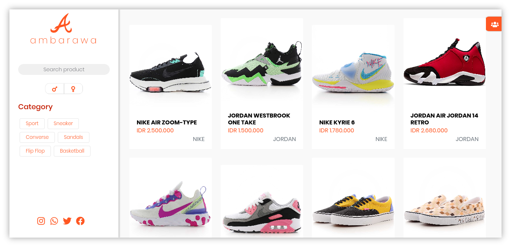

<div align="center">

# ReactJS with Axios



This is an example of CRUD react website I build after joining a free course. I use Axios to fetch data and Bootstrap for CSS framework.

</div>

### Requirements

* [NodeJS](https://nodejs.org/en/) 12+
* NPM 6.10+ or [Yarn](https://yarnpkg.com/getting-started/install) v1.20+

### How To Use

* **Install Package**

```bash
# Using NPM
npm i

# Using Yarn
yarn
```

* **Start database server**

```bash
# Using NPM
npm run db-server

# Using Yarn
yarn db-server
```

> This is not literally database but a JSON file

* **Start development server**

```bash
#Using NPM
npm start

#Using Yarn
yarn start
```
